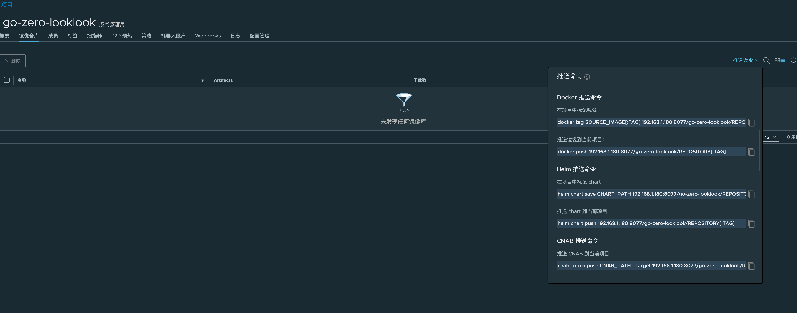
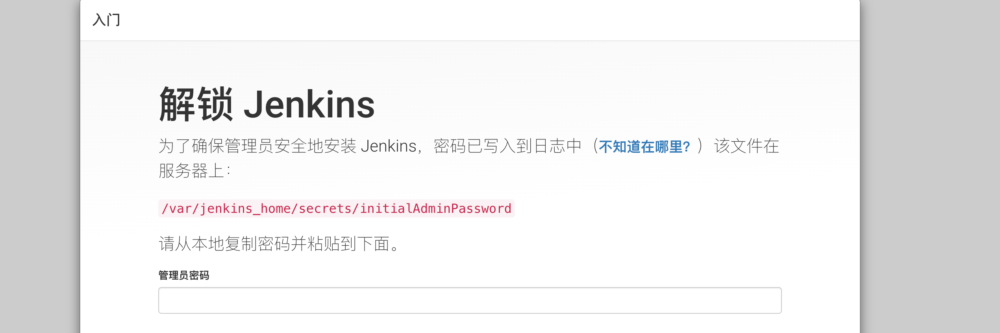

### 	14、部署环境搭建


#### 1、概述

项目开发好后，我们需要部署，我们接下来就基于gitlab + jenkins + harbor + k8s 搭建部署环境

gitlab : 放代码，可以做ci

jenkins：做cd发布项目

harbor : 镜像仓库

k8s : 运行服务


我们只在k8s内部运行服务，至于中间件(mysql、redis、es等)就会部署在k8s之外，如果你是线上使用云服务可以直接使用云服务，如果自建也最好运行在k8s之外。由于我是在本地演示，这里的中间件我就使用之前开发环境的中间件了，不要纠结这个，主要演示如何部署go-zero服务到k8s中

k8s部署这里就不介绍了，如果没有k8s环境自己用rancher或者kubeadm等搭建即可，再不行就去买个按时付费的云服务k8s


所以我们需要配置如下：

| 服务器名称        | 作用                                                         | Ip            |
| ----------------- | ------------------------------------------------------------ | ------------- |
| deploy-server.com | 部署gitlab、jenkins、harbor（预先装好docker、docker-compose） | 192.168.1.180 |
| srv-data.com      | 部署mysql、redis、es等等，模拟独立环境,k8s内部连接到此服务器 | 192.168.1.181 |
| nginx-gateway.com | 网关，独立于k8s集群外部                                      | 192.168.1.182 |
| k8s集群           | K8s 集群                                                     | 192.168.1.183 |


#### 2、gitlab

##### 2.1 部署gitlab

创建文件夹

```shell
$ mkdir gitlab && cd gitlab
$ vim docker-compose.yml
```

docker-compose.yml

```yaml
version: '3'

services:
    gitlab:
      image: 'twang2218/gitlab-ce-zh'
      container_name: 'gitlab'
      restart: always
      hostname: '124.222.161.12' #部署机器的ip,非容器ip(因为是本地不是线上所以用ip，线上的话可以用域名)
      environment:
        TZ: 'Asia/Shanghai'
        GITLAB_OMNIBUS_CONFIG: |
         external_url 'http://124.222.161.12'  #使用这个地址访问gitlab web ui(因为是本地不是线上所以用ip，线上的话可以用域名)
         gitlab_rails['gitlab_shell_ssh_port'] = 2222 #ssh clone代码地址
         unicorn['port'] = 8888 #gitlab一个内部端口
      ports:
        - '80:80'        #web 80 端口
       #- '443:443'      #web 443 端口,本次未使用就不开放了
        - '2222:22'      #ssh 检出代码 端口
      volumes:
        - ./etc:/etc/gitlab             #Gitlab配置文件目录
        - ./data:/var/opt/gitlab  #Gitlab数据目录
        - ./logs:/var/log/gitlab   #Gitlab日志目录
```

执行

```shell
$  docker-compose up -d
```

这个执行时间可能稍微有点长，不妨你可以去泡一杯coffee休息一下～～


##### 2.2 访问gitlab

访问 http://192.168.1.103（即http://"docker-compose中ip/域名"）


首次设置新密码  ： 12345678

账号默认是root


##### 2.3 创建项目


##### 2.4 配置ssh公钥

点击头像位置下箭头，“设置”


将自己的公钥配置上，点击“Add key”即可 （公钥不会生成的自己搜索，这里不详细说了）


##### 2.5 上传项目

在点击项目，回到刚才创建的项目，将aiops项目上传到此仓库ssh://git@192.168.1.180:2222/root/aiops.git即可，到此我们的gitlab搭建就结束了。


【注】 本次不做gitlab-runner演示，后续如果有时间再补充。


#### 3、harbor

##### 3.1 部署harbor

下载harbo https://github.com/goharbor/harbor/releases/download/v2.2.0/harbor-offline-installer-v2.2.0.tgz，下载离线的offline安装会快点

下载解压后进入harbor文件夹 

```shell
$ cd harbor && cp harbor.yml.tmpl harbor.yml
```

我们打开harbor.yml，修改如下

```yml
hostname: 192.168.1.180  																	 #修改为本机ip，不能使用localhost、127.0.0.1

http:
  port: 8077 																							 #改一下http端口8077

#https: 																									 #暂时将https注释掉，我们先不通过https只铜鼓http
#  port: 443
#  certificate: /your/certificate/path
#  private_key: /your/private/key/path

data_volume: /root/harbor/data 		 #修改一下数据目录位置

log:
  level: info
  local:
    rotate_count: 50
    rotate_size: 200M
    location: /root/harbor/log     #修改一下日志目录位置
```

直接运行 “sudo ./install.sh” 稍做等待。


##### 3.2 访问harbor

浏览器输入 http://192.168.1.180:8077

账号: admin

密码: Harbor12345 (在harbor.yml中记录的，默认是Harbor12345)


登陆成功


##### 3.3 新建私有项目


查看push命令



 ```shell
 $ docker push 192.168.1.180:8077/aiops/REPOSITORY[:TAG]
 ```


##### 3.4支持http

默认拉取、推送到镜像仓库要使用https , 由于我们这里没有https，需要用http , 所以我们要在deploy-server.com服务器上执行如下

```shell
$ echo '{"insecure-registries":["192.168.1.180:8077"] }' >> /etc/docker/daemon.json
```


到此我们harbor搭建完成。


#### 4、jenkins

##### 4.1 部署jenkins

创建文件夹

```shell
$ mkdir jenkins && cd jenkins
$ vim docker-compose.yml
```

docker-compose.yml

```yaml
version: '3'
services:
  jenkins:
    image: 'jenkins/jenkins:lts'
    container_name: jenkins
    restart: always
    environment:
      - TZ=Asia/Shanghai
    user: root
    ports:
      - '8989:8080'
      - '50000:50000'
    volumes:
      - './jenkins_home:/var/jenkins_home'
      - '/var/run/docker.sock:/var/run/docker.sock'
      - '/usr/bin/docker:/usr/bin/docker'
      - '/root/port.sh:/root/port.sh'
```

【注】/root/port.sh内容如下

```sh
#!/bin/sh

case $1 in
"identity-api") echo 1001
;;
"identity-rpc") echo 1101
;;
"sys-api") echo 1002
;;
"sys-rpc") echo 1102
;;
"message-mq") echo 1207
;;
"mqueue-rpc") echo 1106
;;
"order-api") echo 1004
;;
"order-mq") echo 1204
;;
"order-rpc") echo 1104
;;
"payment-api") echo 1005
;;
"payment-rpc") echo 1105
;;
"travel-api") echo 1003
;;
"travel-rpc") echo 1103
esac
```

执行

```shell
$ docker-compose up -d
```

这个时间也不慢，可以再去喝一杯coffee


##### 4.2 挂载工具

1）将goctl 复制到 jenkins容器中

```shell
$ docker cp $GOPATH/bin/goctl jenkins:/usr/local/bin
$ docker exec -it jenkins /bin/sh #进入jenkins 容器
$ goctl -v	 #验证成功
goctl version 1.3.0-20220201 linux/amd64
```

2）将kubectl文件复制到jenkins容器中

```shell
$ curl -LO "https://dl.k8s.io/release/$(curl -L -s https://dl.k8s.io/release/stable.txt)/bin/linux/amd64/kubectl"
$ sudo chmod a+x kubectl
$ docker cp kubectl jenkins:/usr/local/bin
$ docker exec -it jenkins /bin/sh #进入jenkins 容器
$ kubectl version
Client Version: version.Info{Major:"1", Minor:"23", GitVersion:"v1.23.3" .....
```

3）将k8s的配置.kube/config复制到jenkins容器

```shell
$ docker cp ~/.kube jenkins:/root/ #前提是家目录下的.kube文件夹中存在k8s的config配置
$ docker exec -it jenkins /bin/sh #进入jenkins 容器
$ kubectl ge ns
default              Active   43m
kube-node-lease      Active   43m
kube-public          Active   43m
kube-system          Active   43m
local-path-storage   Active   43m
```

【注】上面这4部，也可以直接打进镜像中，我这里只是演示，留给你们自己处理。


##### 4.3 访问jenkins

http://192.168.1.180:8989


第一次访问出现上面图不要慌，让你稍等一会，它在进行准备工作，准备好后会自动跳到登陆页面。


出现如下界面，说明准备好了，因为我们目录是挂载出来的，我们查看本机jenkins_home/secrets/initialAdminPassword密码，输入下一步即可




选择“安装推荐插件“ 


 然后等待插件安装完成


##### 4.4 创建用户

root

root


##### 4.5 部署完成


到此 jenkins 部署完成


##### 4.6 添加凭据

点击左边菜单“Manage Jenkins”


点击 "Manage Credentials" 


点击“全局”后面的三角标，然后在点击“添加凭据”


进入“添加凭据”页面，类型我们选择 “SSH Username with private key” 使用私钥方式，`Username`是gitlab一个标识，后面添加pipeline你知道这个标识是代表gitlab的凭据自行自定义的，Private Key`即在gitlab配置的私钥（之前我们配置在gitlab的公钥对应的私钥，在这里就是我们自己本机的私钥），我们这个凭证就是给jenkins用来去gitlab时候免密拉代码用的


确定即可。

##### 4.7 添加harbor仓库配置

进入首页，点击左侧菜单`Manage Jenkins`->`Configure System`


下滑动到`全局属性`条目，添加docker私有仓库相关信息，如图为`docker用户名`、`docker用户密码`、`docker私有仓库地址` 


点击 “保存”


##### 4.8 配置git

进入`Manage Jenkins`->`Global Tool Configureation`，找到Git条目，填写jenkins所在机器git可执行文件所在path，如果没有的话，需要在jenkins插件管理中下载Git插件, 有就不需要管了（如下图）


配置pipline需要的Git Parameter插件

点击 “系统配置” -> “插件管理”


然后点击“可选插件” , 搜索中输入 “Git Parameter” , 如下图


安装好，重启后即可，到此jenkins搭建完成。


#### 5、k8s

k8s的部署这里就不介绍了，自己用kubeadm、rancher、kind去安装吧，或者买个按量云容器服务，总之有一个k8s集群就好了。


​	


